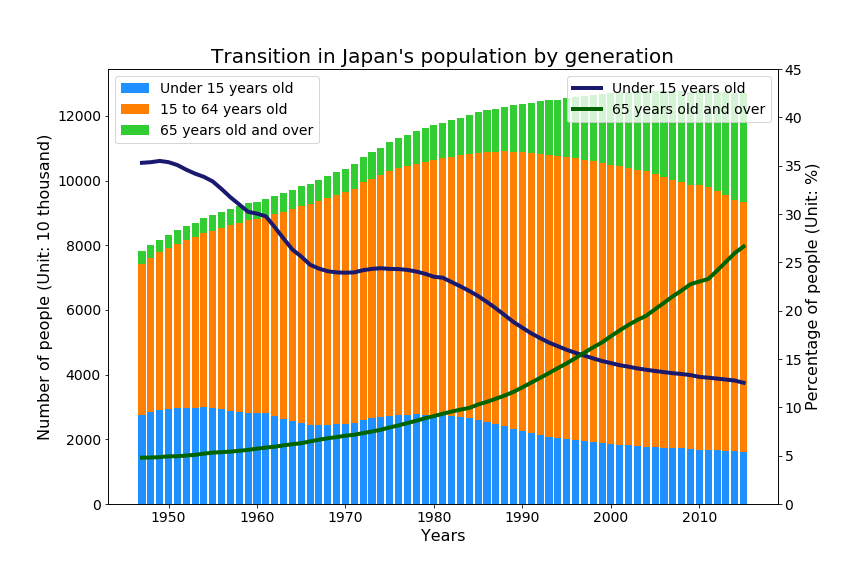

# 日本の世代別人口推移について

現在，日本において少子高齢化は深刻な社会問題となっている．労働力人口の減少に伴う経済規模の縮小や，医療費・年金を中心とした社会保証費の給付と負担の不均衡の加速などが懸念されている．少子高齢化に伴うこれらの問題からも分かるように，一般的に人口の増加率及び世代構成と国の経済成長率には相関があると考えられている．昨今経済の長期停滞期に突入している日本だが，戦後日本は高度経済成長期と呼ばれる急速な経済成長を遂げた時期もあった．そこで今回，戦後から現在に至るまでの日本の人口の変化を，その世代構成の変化も含めて可視化することによって，日本のこれまでを振り返っていく．

今回日本の人口推移の歴史を可視化するにあたって，e-Statが公開している[人口推移の長時期系列データ](https://www.e-stat.go.jp/stat-search/files?page=1&toukei=00200524&tstat=000000090001&cycle=0&tclass1=000000090004&cycle_facet=tclass1%3Acycle)を使用した．e-Statは総務省統計局が中心となって運営している政府統計ポータルサイトであり，人口や経済活動など多様な調査データが公開されている．戦後の1947年から2015年までのデータを用いて，日本の人口と世代構成の推移を可視化したものが以下のグラフである．

上のグラフにおいて，棒グラフは日本の人口を表しており，15歳未満，15歳以上65歳未満，65歳以上の3つの世代に分けてその内訳を同時に表している．2本の折れ線グラフは全人口に占める15歳未満の割合と65歳以上の割合の変化をそれぞれ表している．これらの結果から，日本の人口増加率が年月と共に緩やかになっていること，人口に占める若年者の割合は単調減少，高齢者の割合は単調増加しており，着実に少子高齢化社会が進んでいることなどが分かる．人口増加に関しては，1970年代までは人口は急速に増加していたものの，1980年代以降はその勢いが弱まっており，高度経済成長期が1955年から1973年まで続いたことと照らし合わせても，人口増加と経済成長に相関があることが推察される．少子高齢化に関しては，1947年の時点では若年者の割合の方が30%近く高かった状況が，1997年に初めて高齢者の割合が若年者の割合を上回り，現在は高齢者の割合の方が15%近く上回っている．これは，戦後の経済発展に伴う医療の発展により死亡率が減少したこと，日本社会において未婚化・晩婚化が進展していることに伴い出生率が減少していることなどに起因すると推察される．
